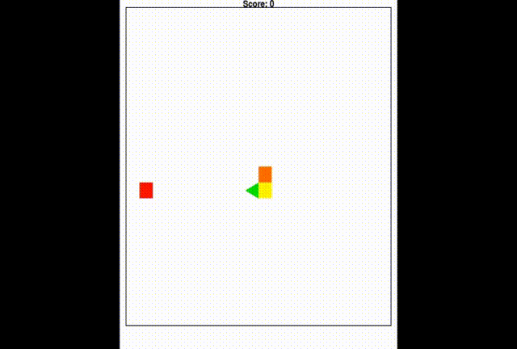

# AI-snake-game

## Introduction
This project utilizes reinforcement deep learning to train an agent to play the Snake game. Two models were trained using Q-learning: one based on a Convolutional Neural Network (CNN) and the other on a Multilayer Perceptron (MLP). Among the two, the CNN model demonstrated superior performance. In 100 test episodes, the CNN-based agent achieved an average of 52 fruits per game, with the best performance reaching 73 fruits in a single game.

## Running Guide

### Environment Setup
```
# Create a conda environment named SnakeAI with Python version 3.8.16
conda create -n SnakeAI python=3.8.16
conda activate SnakeAI

# Use GPU version of PyTorch
conda install pytorch=2.0.0 torchvision pytorch-cuda=11.8 -c pytorch -c nvidia

# Install the required packages
pip install -r requirements.txt
```
### Running the test
```
# Runing cnn model
python test_deep_q_learning_cnn.py

# Running mlp model
python test_deep_q_learning_mlp.py
```

### Training the model
```
# Runing cnn model
python train_deep_q_learning_cnn.py

# Running mlp model
python train_deep_q_learning_mlp.py
```

### Demo
